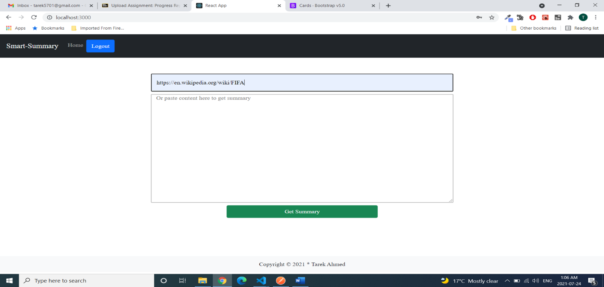
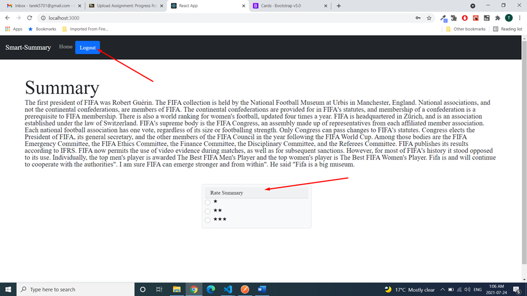

# Smart Summary

Text summarization is the technique by which we can generate short summary of lengthy texts, news articles focusing on the important part of that writing. Smart summary aims to transform lengthy documents in shortened versions, something which could be costly to do manually.

## Summarization steps
1. Data preparation and cleaning
    - Get data from Wikipedia/clipboard source
    - Parse the data
    - Clean unwanted data
2. Tokenizing
    - Create frequency table from the paragraph
    - Tokenize the sentences 
3. Algorithm
    - Create algorithm for scoring each sentence
    - Calculate threshold
    - Generate summary

[Algorithm code](Backend/api/algorithm.py) 

The project seperated into two modules. 
1. [Backend](#backend)(serving data to frontend, actual algorithm to create the summary)
2. [Frontend](#frontend)(UI interface for the users to use the system)
> You have to run frontend and backend seperately and keep both the server running at the same time. For development purpose you can use two terminals in VSCode.

## Backend
- Database setup
  - Install [PostgreSQL](postgresql.org/download/)
  - Remember the root admin password, you will need this to access pgAdmin. Now open **pgAdmin**.
  - Create a database named `smartsummary` with password `postgres`
- Backend Setup
  - CD into the **Backend** folder by `cd Backend`.
  - Check if **python** is installed on the machine. `python --version`
  - Install **Virtualenv** by typing `pip install virtualenv` and check the version of Virtualenv version to confirm if it's installed properly by `virtualenv --version`
  - Create a virtualenvironment for this backend `virtualenv venv`. 
    > Note venv is the name of the folder virtualenv will be created to
  - Activate the virtualenv 
    - `venv\SCripts\activate` for Windows. 
    - `source venv/bin/activate` for MAC.
  - Install the dependencies `pip install -r requirements.txt`
  - **Migrate** the database for initialization `python manage.py migrate`. 
    > Note this is must for to setup for the first time.
  - Create **superuser** for django admin panel `python manage.py createsuperuser`
  - Run the server `python manage.py runserver` 

## Frontend
- Download [`node.js`](https://nodejs.org/en/download/)
- Check node.js version `node -V` or `npm -v`
- Cd into frontend directory `cd frontend`
- Install the required packages to run the frontend website `npm install`
- Start the project `npm install run`
    
    > The project has been bootstraped with `create-react-app`. See [guide](frontend/README.md)

## DEMO

